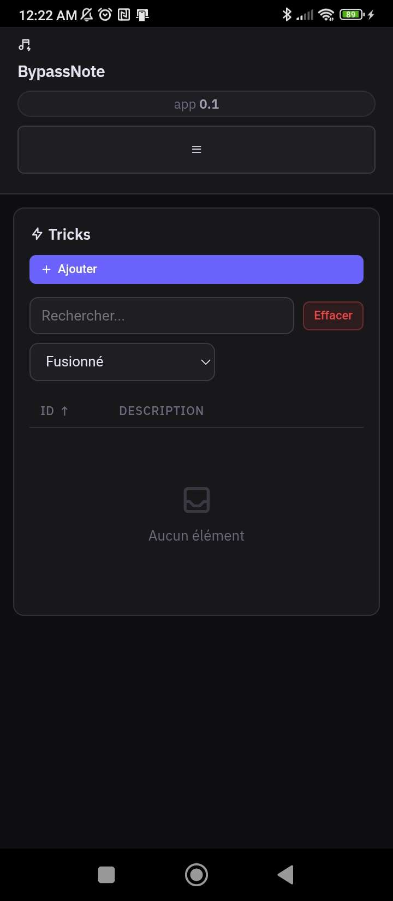
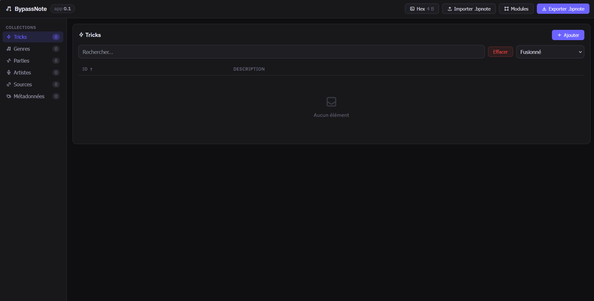

# BypassNote

<div align="center">
  
</div>

## Overview

<div align="center">
  
</div>



## Build web app

```sh
npm install

npm run build-proto
```

## Build app for android

> [!Important] 
> the android app is built from the web app. so, you need to build it before the android app

```sh
npx cap add android

npx cap sync

npx capacitor-assets generate

npx cap sync
```

Configure your Android SDK with the `ANDROID_SDK_ROOT` environment variable.

Example on Windows (replace `<your-user>` with your Windows username):

```powershell
setx ANDROID_SDK_ROOT "C:\Users\<your-user>\AppData\Local\Android\Sdk"
```

Then run:

```sh
npx cap run

npx cap build android
```

---

## Build desktop app with Tauri

This branch includes Tauri configuration for building desktop applications (Windows, macOS, Linux).

### Prerequisites

- [Rust](https://www.rust-lang.org/tools/install) (1.70 or later)
- [Node.js](https://nodejs.org/) (18 or later)

### Running the app

#### Development mode
```bash
npm run tauri dev
```

#### Production build
```bash
npm run tauri build
```

### Building for all platforms

The GitHub Actions workflow automatically builds for Windows, macOS, and Linux. You can also build locally:

```bash
# Windows
npm run tauri build -- --target x86_64-pc-windows-msvc

# macOS
npm run tauri build -- --target universal-apple-darwin

# Linux
npm run tauri build -- --target x86_64-unknown-linux-gnu
```