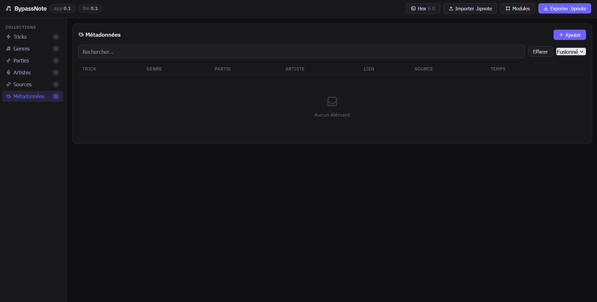

# BypassNote



## Build app for android

```sh
npm install

npm run build-proto

npx cap add android

npx cap sync

npx capacitor-assets generate

npx cap sync
```

Configure your Android SDK with the `ANDROID_SDK_ROOT` environment variable.

Example on Windows (replace `<your-user>` with your Windows username):

```powershell
setx ANDROID_SDK_ROOT "C:\Users\<your-user>\AppData\Local\Android\Sdk"
```

Then run:

```sh
npx cap run

npx cap build android
```